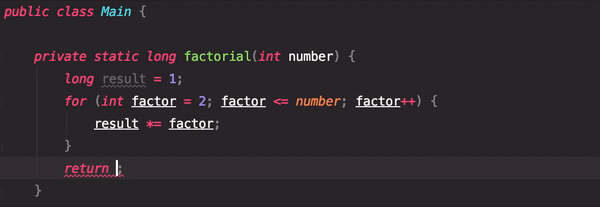

# Introduction to JetBrains IDEs

IDEs are tools to make software development easier, more robust and less error-prone. 
They support code navigation, code completion, code refactoring and code generation.
JetBrains IDEs put a lot of focus on code completion, intentions and automatic error fixing.

This tutorial will use IntelliJ, an IDE for Java, to show these features, but other JetBrains tools share the style and display most of the same characteristics.

## Code completion
Code completion helps you complete the names of classes, methods, fields, and keywords within the visibility scope. When you invoke code completion, IntelliJ analyses the context and suggests the choices that are reachable from the current caret position.

1. Start typing a name.
2. Press \<ctrl+space\> to invoke code completion.
3. Use arrow keys to navigate the list of suggestions.
4. Press \<enter\> or double-click a list item to insert it.

You can narrow down the suggestions list by typing any part of a word (even characters from somewhere in the middle) or invoking code completion after a dot separator. IntelliJ IDEA will show suggestions that include the characters you've entered in any positions.

## Intention actions
As you work in the editor, IntelliJ IDEA analyzes your code, searches for ways to optimize it, and detects potential and actual problems.

As soon as the IDE finds a way to alter your code, it displays a yellow bulb icon yellow bulb icon in the editor next to the current line. By clicking this icon, you can view intention actions available for this unit of code. Intention actions cover a wide range of situations from warnings to optimization suggestions.

A red bulb with an exclamation mark the Quick-fix icon indicates that IntelliJ IDEA has detected a problem, and prompts you to select an associated fix.

1. Click the light bulb icon or press \<alt+enter\> to open the list of suggestions.
2. Use arrow keys to navigate the list.
3. Press \<enter\> or double-click a list item to select that action.
