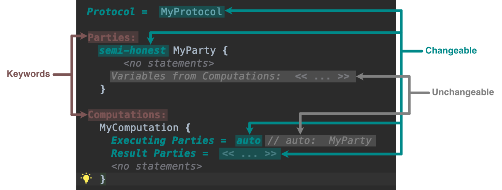

# Chisel
Chisel is a domain-specific language for advanced cryptography, specifically Fully Homomorphic Encryption (FHE) and Multi-Party Computation (MPC). 
Chisel is written in JetBrains MPS and is based on Java. If you only want to use this language, you do not need to know anything about MPS. Experience in Java and JetBrain tools is beneficial though. 
If you want to change or extend Chisel and do not have experience with MPS, I can highly recommend the ["Fast Track to MPS"](https://www.jetbrains.com/help/mps/fast-track-to-mps.html) as well as [the official tutorials](https://www.jetbrains.com/help/mps/mps-tutorials.html).

## Installation
1. Download JetBrains MPS here: https://www.jetbrains.com/mps/ .
2. Download this repository.
3. Open MPS and select "Open Project", then navigate to the downloaded folder.
4. You might want to press \<cmd+1> / \<alt+1> to show the navigation bar and \<cmd+2> / \<alt+2> to show the inspector.

## Navigation
In the navigation bar you should see five directories.
- *ChiselLang* This is where the Chisel language is defined
- *ChiselLang.sandbox* Here you can write code in the Chisel language
- *Matrix* This is a helper language that defines matrices
- *Matrix.runtime* This links the Matrix language to Java
- *Matrix.sandbox* Here you can write code in the Matrix language

## Usage
1. Rebuild the Matrix language by right-clicking on *Matrix* in the navigation bar and selecting "Rebuild Language 'Matrix'".
2. Rebuild the Chisel language by right-clicking on *ChiselLang* in the navigation bar and selecting "Rebuild Language 'ChiselLang'".
3. Open *ChiselLang.sandbox*->*ChiselLang*->*sandbox*. There you should see some example protocols.
4. To create a new protocol, right-click on *sandbox*, then select "New"->"ChiselLang"->"Protocol".

## Projectional Editors
Standard code editors are textual editors, meaning you write text that is then parsed and compiled. 
MPS is a projectional editor, meaning you directly specify the AST, no parsing and compiling needed.
This entails that the structure of your code is quite strictly predefined.

Everytime you see red underlined code and the message "Error: Abstract conecpt instance detected. Use one of sub-concepts instead.", you are probably not adhering to this strucure. 
Be aware that you might not *see* a difference between your code and the correctly structured code, as is demonstrated in the following screenshot.

To mitigate this problem, it is important to use auto-completion and intentions as often as possible.
Please reference [this tutorial](https://github.com/MarbleHE/Chisel/blob/master/IntroToJetBrains.md) on how to do that.

## How to write code
- A gray \<no statements> marker indicates where you can write Java code.
- The color of the font gives information about the changeability of the text, as explained in the following image. 
  
- For changeable text, either  the  whole  statement  can  be exchanged, or the part after the equal sign can be set, as seen in the next two images, both times using auto-complete to show the possibilities.
  
  
- Errors can often be fixed by using intentions, as shown here.
  

## How to do secure computations
- To mark a variable as secret, write "secret" after the "static" keyword. There also exists an intention to add the "secret" keyword. Note that only top-level variables can be marked as secret.
- To mark a computation as secure, write "crypto" after the computation name. There also exists an intention to add the "crypto" keyword.
- A party that gets the result of a computation can access that result in a later computation. You can see all these references listed under "Variables from Computations" for each party, e.g. "i" in the example below. To access such a variable, you use the "Result Reference" function, e.g. "Result Reference ( MyParty, i)" in the example below.
  
  
## Matrix Language 
- You can define matrices by typing "Matrix", which should then autofill to Matrix\<\<type>> \<no name>.
- You can then initialize it by typing "={", which should give you a square that you can fill with your matrix. 
- First, press \<enter> for each row you need in your matrix.
- Going back to each row, enter your values into a row, pressing \<enter> after each value.
  
- You can access a cell of the matrix by using methods Matrix.get(\<i>,\<j>) and Matrix.set(\<i>,\<j>,\<value>).
- The following operations are available for Matrices: 
  - Matrix.mult(Matrix)
  - Matrix.mult(int)
  - Matrix.add(Matrix)
  - Matrix.sub(Matrix)

## Known Bugs
- Please ignore the error “The reference … is out of search scope” on a party or variable reference.
- The automatic “auto” fill in executing parties might show up again after deleting it. Just delete it again, then it should stay deleted.
- Please ignore the "(generation required)" in the navigation bar.
